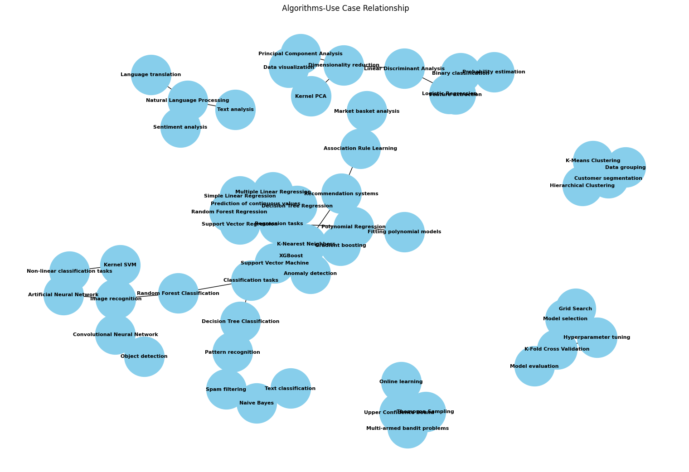

# ML-templates

In progress...I hope you enjoy this repository.
| Notebook Topic                       | Use Case                                                     |
|------------------------------------|--------------------------------------------------------------|
| NLP                                | Natural Language Processing                                  |
| Association_rule_learning          | Market basket analysis, web log analysis                    |
| Classification                     | Predictive modeling, pattern recognition, image recognition, text classification |
| Clustering                         | Grouping similar data points, customer segmentation         |
| Deep_learning                      | Image recognition, object detection,  feature learning, Classification, Regression, Forecasting |
| Dimensionality_reduction           | Feature extraction, data visualization, noise reduction     |
| Model_selection                    | Finding optimal model hyperparameters, improving model performance |
| Regression                         | Predicting continuous values, trend analysis                 |
| Reinforcement_learning             | Optimizing decision-making, game playing strategies          |
